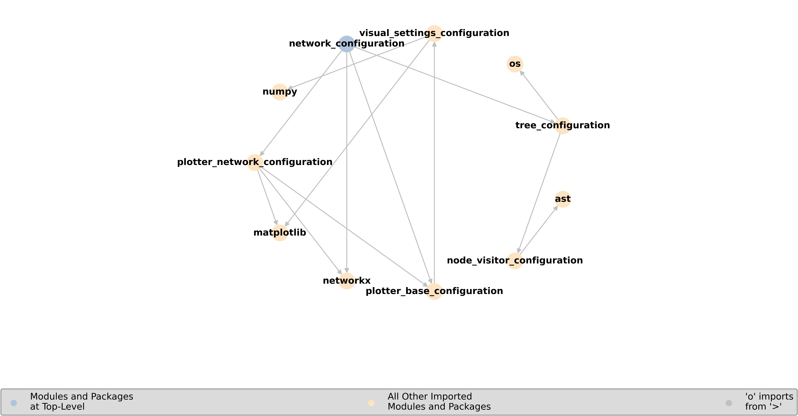

# Repo:    module-network-tree

This purpose of this code is to better understand and keep track of the hierarchical relationships between multiple files in a code-base.

## Description

If one has multiple files in a code-base, then it can become complicated to keep track of the hierarchy structure of imports. Given the path to the directory that contains the code-base files, this code uses `networkx` to create a network in which the nodes are the files and the directed edges are the one-way imports. Once the network is initialized, one can view the graph network that shows the relationships between these files - this includes imports and top-level packages; one can also view a text-file that contains this information. 

This code is a working roughdraft that can be further optimized for speed, clarity, utility, and length.

## Getting Started

### Dependencies

* Python 3.9.6
* numpy == 1.26.4
* matplotlib == 3.9.4
* networkx == 3.2.1
* os (default)
* ast (default)

### Executing program

* Download this repository to your local computer
* Modify `path_to_directory` and `path_to_save_directory` in `src/example.py`, then run the script

## Version History

* 0.1
  * Initial Release

## To-Do
* make text-file using `|` and `_` to show import hierarchy structure
* arrange plotted network as cleaner structure of layers

## License

This project is licensed under the GNU AFFERO GENERAL PUBLIC LICENSE - see the LICENSE file for details.
